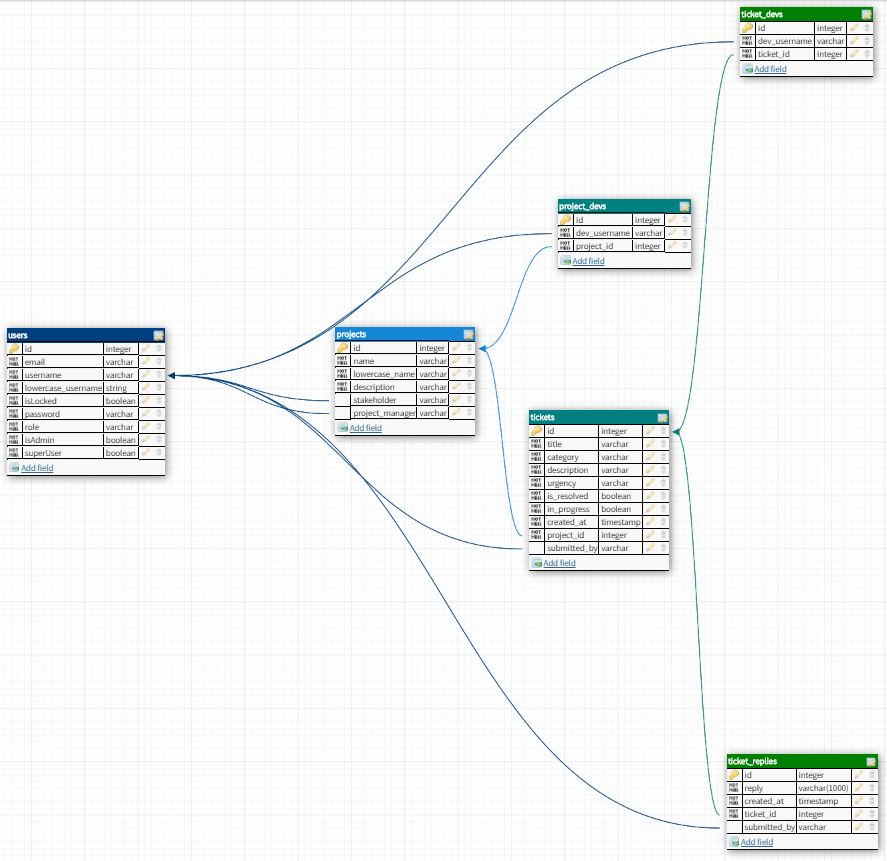

<!-- prettier-ignore-start -->
# **Routes**
### _(_**all** _endpoints require authentication)_

-  ## Login and register
    - ### Endpoints
    | Method | URL _(base:_ `/auth`)    | Description                                                        |
    |:-------| :----------------------: | -----------------------------------------------------------------: |
    | POST   | **`/login`**             | User login (accepts username OR email), returns username and token |
    | POST   | **`/register`**          | User registration, returns new user's username and token           |
    - ### DB access functions
        _**See:**_ **`findByUsername()`** _and_ **`add()`** _in "Users" section below_

-  ## Users
    - ### Endpoints
    - ### DB access functions
        - **`findById(id)`**:  returns user with corresponding `id` if user exists
        - **`findByUsername(username)`**:  returns user with corresponding `username` if user exists
        - **`findByEmail(email)`**:  returns user with corresponding `email` if user exists
        - **`add(user)`**: adds user to database and returns new user

-  ## Tickets
    - ### Endpoints
    | Method | URL _(base:_ `/tickets`)      | Description                                                                                         |
    |:-------| :---------------------------: | --------------------------------------------------------------------------------------------------: |
    | GET    | **`/:id`**                    | Fetch ticket with specified `ticket_id`, gets associated replies and devs                           |
    | GET    | **`/by_project/:id`**         | Fetch all tickets associated with given project that has specified `project_id`                     |
    | GET    | **`/submitted_by/:username`** | Fetch all tickets posted by given user with specified `username`                                    |
    | PUT    | **`/edit/:id`**               | Edit and return ticket with given `ticket_id` **if user is a superuser, admin or author of ticket** |
    - ### DB access functions
        - **`findByProject(project_id)`**:  returns all tickets associated with given `project_id`:  if tickets exist, returns an array of all tickets associated with project with given `project_id`.  **Ex:**
            ```
            [
                {
                    "id": 3,
                    "title": "New feature idea",
                    "category": "new feature suggestion",
                    "description": "Add ability for users to view all plants that we track that are growable in their growth zone.",
                    "urgency": "low",
                    "is_resolved": 0,
                    "in_progress": 1,
                    "created_at": 1579572651699,
                    "submitted_by": "April",
                    "project_id": 3
                },
                {
                    "id": 4,
                    "title": "Memoize functional components",
                    "category": "Refactor",
                    "description": "Due to the number of forms on the dashboard, too many components are rerendering during form input.  We should optimize that with memoization",
                    "urgency": "low",
                    "is_resolved": 1,
                    "in_progress": 0,
                    "created_at": 1579572651699,
                    "submitted_by": "Mike",
                    "project_id": 3
                }
            ]
        - **`findTicket(ticket_id)`**:  if ticket exists, returns ticket with given `ticket_id`.  All associated replies and developers attached as an array.  **Ex:**
            ```
            {
                id: 2,
                title: "Major security threat",
                category: "bug",
                description: "A console.log accidentally got left in during development and is recording user passwords on login.  Needs immediate fix for security.",
                urgency: "high",
                is_resolved: 1,
                in_progress: 0,
                created_at: 1579501253893,
                submitted_by: "Mike",
                project_id: 2,
                replies: [
                    {
                    reply: "I have removed the console.log from both login and register components.  Changes have been pushed up to github with pull request opened, awaiting code review.",
                    created_at: 1579501253904,
                    submitted_by: "Jackson"
                    },
                    {
                    reply: "Total accident, wont let it happen again.",
                    created_at: 1579501253904,
                    submitted_by: "Bernard"
                    },
                    {
                    reply: "Whoopesies.",
                    created_at: 1579501253904,
                    submitted_by: "Bernard"
                    }
                ],
                devs: [
                    {
                    username: "Bernard"
                    },
                    {
                    username: "Mike"
                    }
                ]
            }                  
        
-  ## Projects
    - ### Endpoints
    | Method | URL _(base:_ `/projects`)     | Description                                                                                         |
    |:-------| :---------------------------: | --------------------------------------------------------------------------------------------------: |
    | GET    | **`/name_search/:name`**      | Fetch project with specified `name` with associated developers                                      |
    | GET    | **`/id_search/:name`**        | Fetch project with specified `id` with associated developers                                        |
    - ### DB access functions

# **Schema**

### _( \* = field **required**)_

-  ## **`users`**

   <a href="https://github.com/indiMjc/anteaters-be/blob/master/data/migrations/20200114211142_users.js" target="_blank">Users migration file</a>

   | Field                 | Type | Default | Metadata                        |
   | :-------------------- | :--: | :-----: | ------------------------------: |
   | \* id                 | int  | auto    | Primary key                     |
   | \* email              | str  |         | User email                      |
   | \* username           | str  |         | Username                        |
   | \* password           | str  |         | User password                   |
   | \* role               | str  |         | User role                       |
   | \* superUser          | bool | false   | Super user permission           |
   | \* isAdmin            | bool | false   | Admin permission                |
   | \* isLocked           | bool | false   | Locked account                  |

-  ## **`projects`**

   <a href="https://github.com/indiMjc/anteaters-be/blob/master/data/migrations/20200114211150_projects.js" target="_blank">Projects migration file</a>

   | Field             | Type | Default | Metadata                            | Foreign key (references) |
   | :---------------- | :--: | :-----: | :---------------------------------: | -----------------------: |
   | \* id             | int  | auto    | Primary key                         |                          |
   | \* description    | str  |         | Project description                 |                          |
   | stakeholder       | str  |         | Project stakeholder/owner           | `username` in `users`    |
   | project_manager   | str  |         | Project manager/team lead           | `username` in `users`    |

-  ## **`project_devs`**

   <a href="https://github.com/indiMjc/anteaters-be/blob/master/data/migrations/20200114211202_project_devs.js" target="_blank">Project devs migration file</a>

   | Field           | Type | Default | Metadata                          | Foreign key (references) |
   | :-------------- | :--: | :-----: | :-------------------------------: | -----------------------: |
   | \* id           | int  | auto    | Primary key                       |                          |
   | \* dev_username | str  |         | Developer working on this project | `username` in `users`    |
   | \* project_id   | str  |         | Project ID                        | `id` in `projects`       |

-  ## **`ticket_devs`**

   <a href="https://github.com/indiMjc/anteaters-be/blob/master/data/migrations/20200114211213_ticket_devs.js" target="_blank">Ticket devs migration file</a>

   | Field           | Type | Default | Metadata                         | Foreign key (references) |
   | :-------------- | :--: | :-----: | :------------------------------: | -----------------------: |
   | \* id           | int  | auto    | Primary key                      |                          |
   | \* ticket_id    | int  |         | Ticket ID                        | `id` in `tickets`        |
   | \* dev_username | str  |         | Developer working on this ticket | `username` in `users`    |

-  ## **`tickets`**

   <a href="https://github.com/indiMjc/anteaters-be/blob/master/data/migrations/20200114211218_tickets.js" target="_blank">Tickets migration file</a>

   | Field          | Type      | Default         | Metadata                                | Foreign key (references) |
   | :------------- | :-------: | :-------------: | :-------------------------------------: | -----------------------: |
   | \* id          | int       | auto            | Primary key                             |                          |
   | \* title       | str       |                 | Ticket title                            |                          |
   | \* category    | str       |                 | Ticket category                         |                          |
   | \* description | str       |                 | Ticket description                      |                          |
   | \* urgency     | str       |                 | Ticket urgency                          |                          |
   | \* is_resolved | bool      | false           | Marks if ticket has been resolved       |                          |
   | \* in_progress | bool      | false           | Marks if a dev is working on the ticket |                          |
   | \* created_at  | timestamp | `knex.fn.now()` | Time and date the ticket was submitted  |                          |
   | submitted_by   | str       |                 | User who submitted ticket               | `username` in `users`    |
   | \* project_id  | int       |                 | Project ID                              | `id` in `projects`       |

-  ## **`ticket_replies`**

   <a href="https://github.com/indiMjc/anteaters-be/blob/master/data/migrations/20200114211228_ticket_replies.js" target="_blank">Ticket replies migration file</a>

   | Field         | Type      | Default         | Metadata                          | Foreign key (references) |
   | :------------ | :-------: | :-------------: | :-------------------------------: | -----------------------: |
   | \* id         | int       | auto            | Primary key                       |                          |
   | \* reply      | str       |                 | Ticket reply                      |                          |
   | \* created_at | timestamp | `knex.fn.now()` | Time and date reply was submitted |                          |
   | \* ticket_id  | int       |                 | Ticket ID                         | `id` in `tickets`        |
   | submitted_by  | str       |                 | User who submitted reply          | `username` in `users`    |


<!-- prettier-ignore-end -->
